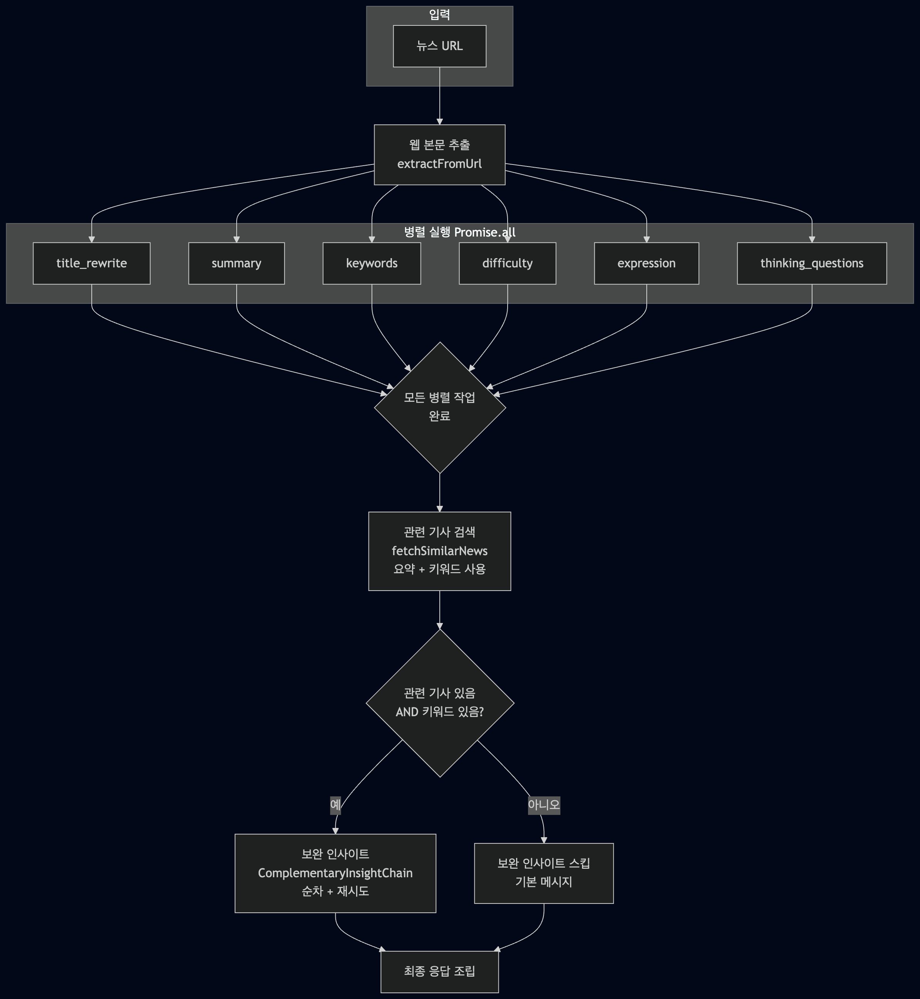
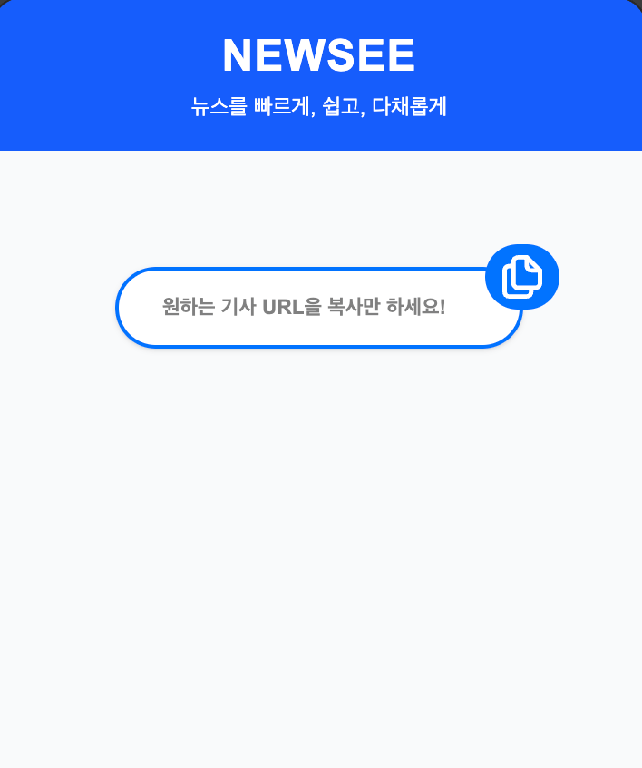
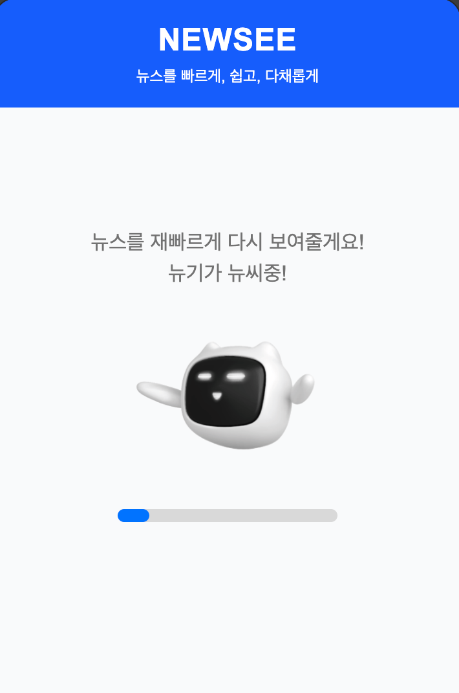
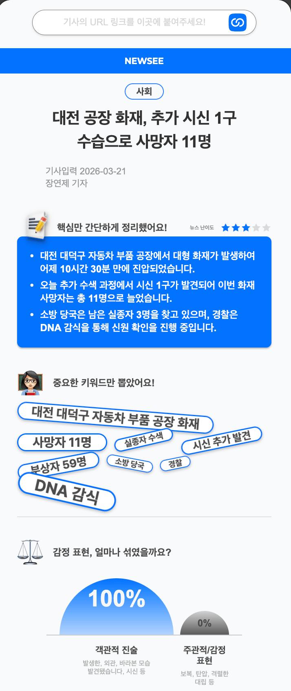
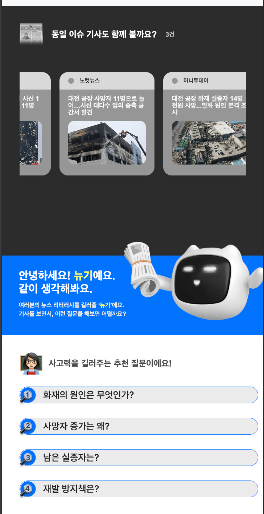
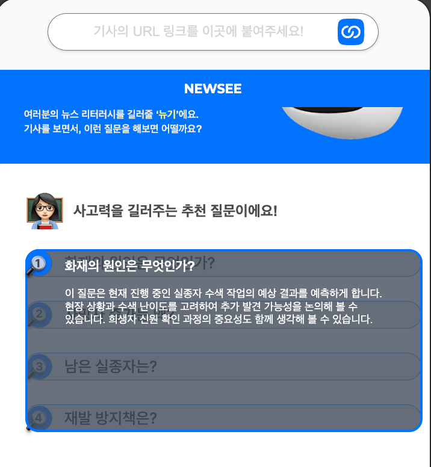
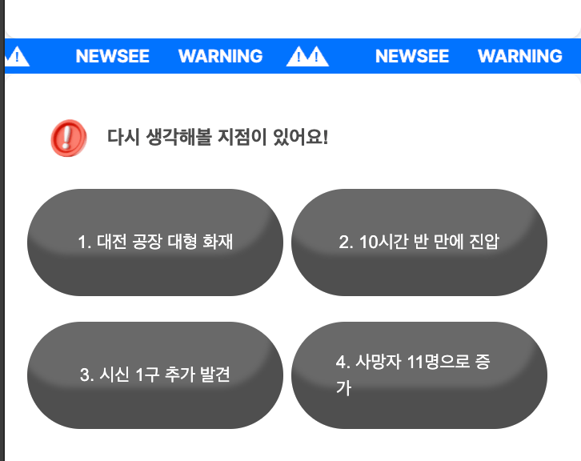
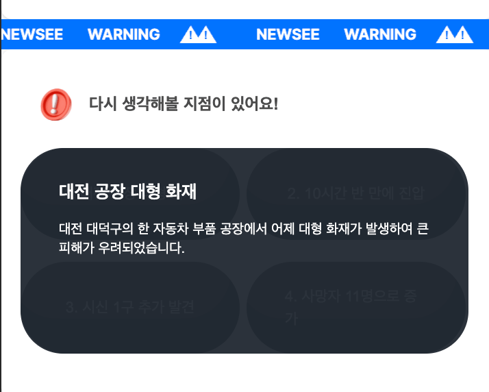
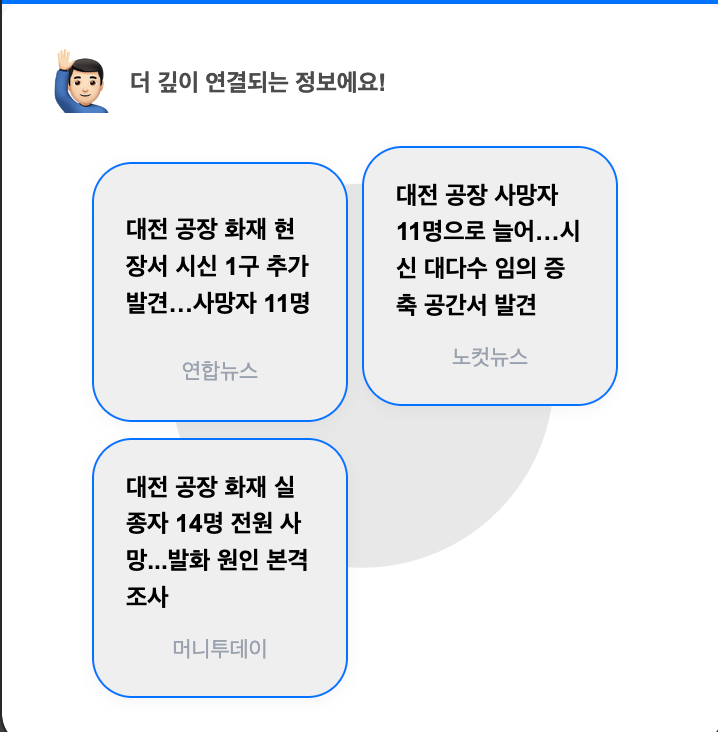

# FactFlow 

## 프로젝트 소개

**FactFlow**는 **Next.js**, **TypeScript**, **LangChain** 기반의 **뉴스 기사 URL 분석** 웹 애플리케이션이다. 기사 링크를 입력(또는 붙여넣기)하면 **요약·키워드·난이도·표현 분석·사고형 질문·보완 인사이트** 등을 보여 주고, **Recoil**·**Zod**·**Axios**로 상태와 검증을 처리한다.

### 개발 기간
- 2025.06 ~ 07

### 팀 소개
| [**우병희**](https://github.com/dnqudgml12) | [**김현중**](https://github.com/hjkim0905) | [**윤동혁**](https://github.com/Diggydogg) |
|---|---|---|
| Frontend, Langchain | Frontend |  Frontend, Langchain |

## 주요 기술

### LangChain 병렬 처리

`NewsAnalysisService`에서 본문·제목을 넣은 뒤, **제목 재작성·요약·키워드·난이도·표현·사고 질문** 등 여러 LangChain 체인을 **`Promise.all`로 한 번에 병렬 실행**한다. 각 체인은 재시도·쿼터 오류 처리가 들어가 있고, 이 단계가 끝난 뒤에만 요약·키워드를 모아 **관련 기사 검색**과 **보완 인사이트(ComplementaryInsight)** 같이 앞 단계 결과에 의존하는 분석을 이어서 수행한다.

```ts
// lib/langchains/service/newsAnalysisService.ts — runAllAnalyses (요지)
const basicTasks = basicAnalyses.map(async (analysisType) => {
  // analysisType별로 title / summary / keywords / difficulty / expression / questions 체인 invoke
  // … executeWithRetry로 감싼 뒤 results[analysisType]에 저장
});
await Promise.all(basicTasks); // 6개 기본 분석 병렬 완료
// 이후: fetchSimilarNews(요약, 키워드) → complementary 인사이트 순차 실행
```

### 크롤링 · 본문 추출

입력 URL에 대해 **Axios로 HTML을 가져오고**, **Cheerio로 DOM을 파싱**해 제목·작성자·게시일·본문을 뽑는다. 요청에는 브라우저에 가까운 `User-Agent`·타임아웃·리다이렉트 한도를 두어, 뉴스 사이트 HTML을 서버에서 안정적으로 긁어 오도록 했다.

```ts
// lib/langchains/utils/contentExtractor.ts — extractFromUrl (발췌)
const response = await axios.get(url, {
  headers: { "User-Agent": "Mozilla/5.0 ... Chrome/120.0.0.0 Safari/537.36", /* … */ },
  timeout: 10000,
  maxRedirects: 5,
});
const $ = cheerio.load(response.data);
const title = extractTitle($);
const content = extractMainContent($);
```
### 병렬 다이어그램



### 관련 뉴스(외부 검색)

유사 기사 목록은 HTML을 추가로 크롤링하는 대신, **네이버 뉴스 검색 Open API**(`fetchSimilarNews`)로 요약·키워드를 쿼리에 넣어 가져온다. 이를 위해 `NAVER_CLIENT_ID`, `NAVER_CLIENT_SECRET` 환경 변수가 필요하다.

## 개발 기간

- 진행 중

## 배포 · 실행 환경

- **Next.js** 웹 앱으로 로컬에서 `npm run dev`(기본 `http://localhost:3000`)로 실행한다.
- 프로덕션 배포는 **Vercel** 등 Next 호스팅에 맞춰 설정하면 된다. (팀 배포 URL이 정해지면 이 항목에 추가한다.)

---

## 시작 가이드

### 요구 사항

- Node.js (LTS 권장)
- npm

### 환경 변수

프로젝트 루트에 `.env` 또는 `.env.local`을 두고, OpenAI·Anthropic·Google GenAI 등 **LangChain에서 사용하는 API 키**와, 관련 뉴스 기능을 쓸 경우 **`NAVER_CLIENT_ID` / `NAVER_CLIENT_SECRET`**을 설정한다. (전체 변수명은 `lib/langchains/config/aiModelConfig.ts` 및 API 라우트를 참고한다.)

### 설치 및 실행

```bash
git clone https://github.com/hjkim0905/FactFlow_FE.git
cd FactFlow_FE
npm install
```

**개발 서버 (Turbopack)**

```bash
npm run dev
```

**프로덕션 빌드 및 실행**

```bash
npm run build
npm start
```

### 기타 스크립트

```bash
npm run lint   # Next.js ESLint
```

---

## 기술 스택

### 개발 환경


### 언어 · 프레임워크


### AI · 데이터 · 크롤링


### 상태 · 스타일


### UI · 도구


---

## 화면 구성

스크린샷은 [`docs/`](./docs/)에 둔다. 파일명은 영어(`factflow-*.png`)로만 통일해 GitHub 등에서 경로가 깨지지 않게 했다.

### 서비스 플로우



**서비스 진입 시 보여 주는 초기 화면이다.**



**LangChain 파이프라인이 동작하는 동안 진행 상태를 보여 주는 로딩 화면이다.**




**분석한 뉴스의 요약·키워드·감정 등 상세 분석 결과를 보여 주는 화면이다.**




**본 기사와 연관된 기사 및 비판적·확장적 사고를 돕기 위해, 기사 내용과 연결된 추천 질문과 질문 의도 설명을 보여 준다.**




**추천 질문에 대한 질문 의도 설명을 보여 준다**



**기사를 네 단계(배경·전개·핵심·파급 등)로 나눈 짧은 머리글을 보여 준다.**




**짧은 머리글에 대한 자세한 설명을 보여 준다.**



**유사하거나 이어 읽을 만한 관련 뉴스를 안내하는 영역이다.**

---

## 아키텍처 및 디렉터리 구조

```text
FactFlow_FE/
├── public/                 # 정적 자산, SVG 등
├── app/
│   ├── layout.tsx
│   ├── page.tsx            # 메인(폼 / 로딩 / 결과)
│   └── api/                # Route Handlers (뉴스 분석, OG 이미지 등)
├── components/             # NewsAnalysisForm, 결과·로딩 UI 등
├── lib/
│   ├── hooks/              # useNewsAnalysis 등
│   ├── langchains/         # 모델 설정, 체인, 서비스
│   └── pipelines/          # 뉴스 분석 파이프라인
├── docs/                   # README용 스크린샷 (파일명 영어)
├── package.json
├── next.config.mjs
└── tsconfig.json
```

---

## 라우트

| 경로 | 설명 |
|------|------|
| `/` | 메인 — 뉴스 URL 입력 및 분석 결과 |

주요 API (참고)

| 경로 | 설명 |
|------|------|
| `POST /api/news/analyze` | 뉴스 URL 분석 |
| `GET /api/og-image` | OG 메타 이미지 등 보조 엔드포인트 |

---
